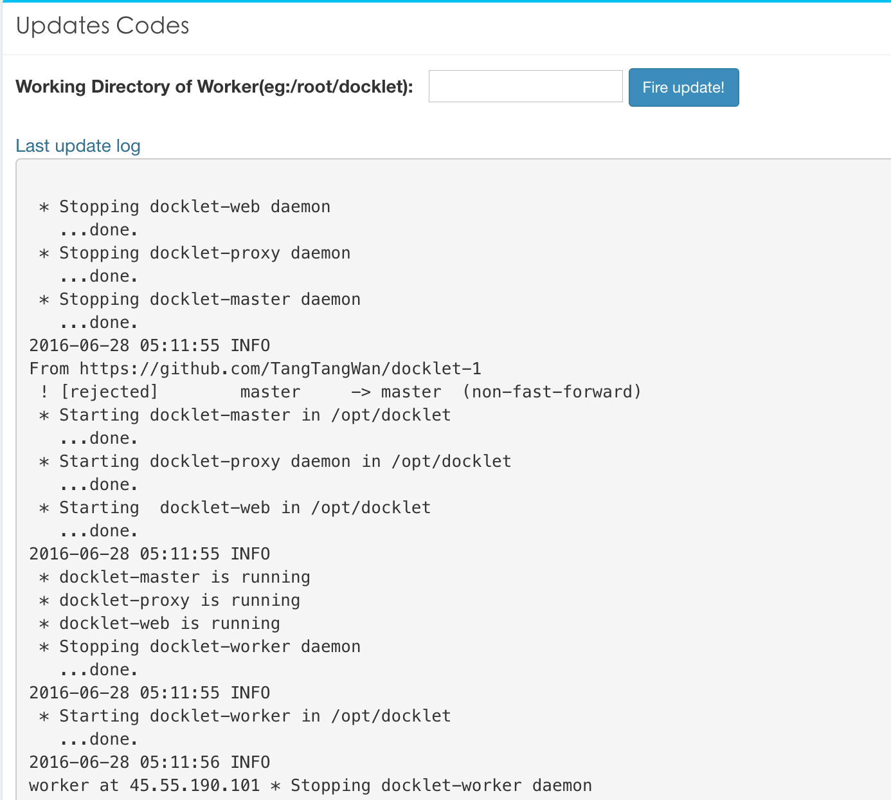

# 系统自动更新

编写者：潘虹

代码地址：https://github.com/TangTangWan/docklet-1

#### 任务目标

1. 在管理页面添加控制界面，用于发布更新命令
2. 发布命令后每台机器自动更新升级
3. 记录升级的结果

#### 准备工作

1. 修改conf/docklet.conf文件的WORKER_ADDRESSESS配置项，填入各worker的物理地址，用空格隔开；修改LOCAL_WORKER配置项，表示master所在机器上是否还运行worker，若是，填写True

2. 配置好主机之间的ssh免登陆环境

3. 配置好各机器上git的环境和ssh key（用于免登陆更新代码）

4. 确定python安装了threading包依赖（用于web.py非阻塞式调用更新脚本）

#### 设计过程和实现逻辑

1. 大概浏览页面结构，认为相关功能加在admin页面最为合理。因此在admin页面加入bootstrap的

区块实现更新功能，符合页面的整体设计风格。
2. 页面结构如下：
   - worker工作目录，如/root/docklet-1。用于表示各worker机器上代码目录。
   - 确认按钮，用于发送更新请求
   - 更新日志显示区域
3. 前端逻辑如下：
   - 采用<form><input>等html元素实现数据输入与post请求发送。
   - onclick事件实现更新开始的提醒功能
   - js代码在页面加载完后ajax请求访问update_log.txt文件，_更新页面相关区域，显示更新日志
4. 后端逻辑如下：
   - POST请求发送输入数据
   - master所在主机获取到命令，调用tools/auto_update_master.sh脚本
   - auto_update_master.sh脚本关闭本机master和worker，利用git pull命令更新代码并启动，然后ssh登录到各worker，调用worker的更新脚本
   - worker的更新脚本关闭系统，根据git地址clone新的代码，并重新启动
   - 更新的log写入static/update_log.txt文件
   - 完成更新之后后端返回admin页面。

#### 效果展示

使用更新功能前：

 更新之后：

#### 新增/修改文件：

| 文件名                         | 新增/修改    |
| --------------------------- | -------- |
| tools/auto_update_worker.sh | add      |
| tools/auto_update_master.sh | add      |
| tools/update_output.txt     | add      |
| conf/docklet.conf           | modified |
| web/templates/admin.html    | modified |
| web/web.py                  | modified |
| web/static/update_log.txt   | add      |

#### 不足之处

1. 鲁棒性不足：

   + 当网络状况不佳或遇到错误等导致worker没有及时响应master的时候，就会长时间等待，或出现“网页未发送任何数据”错误,刷新后正常

   + 有时候提交表单后会遇到requests.exceptions.ConnectionError，具体报错如下：

     > requests.exceptions.ConnectionError: HTTPConnectionPool(host='0.0.0.0', port=9000): Max retries exceeded with url: /user/groupList/ (Caused by NewConnectionError('<requests.packages.urllib3.connection.HTTPConnection object at 0x7f30ffeed240>: Failed to establish a new connection: [Errno 111] Connection refused',))

     尚未知道具体原因，且出错情况不稳定（有时候有，有时候无，如遇到，需要重启master才能解决）

2. 异常错误和日志信息不完善：

   目前只有基本的日志信息输出, 且格式粗糙，不够美观。

3. 不能实时在web端显示更新的进度，需要依靠手工刷新页面来读取log的相关信息来判断更新是否完成

4. 要求所有worker机器上的docklet部署在相同路径下