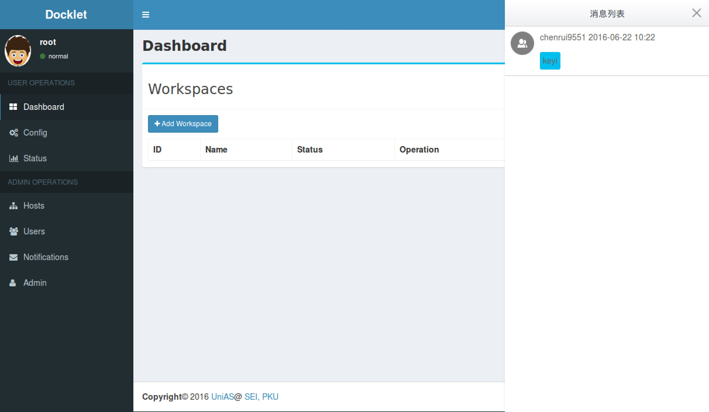
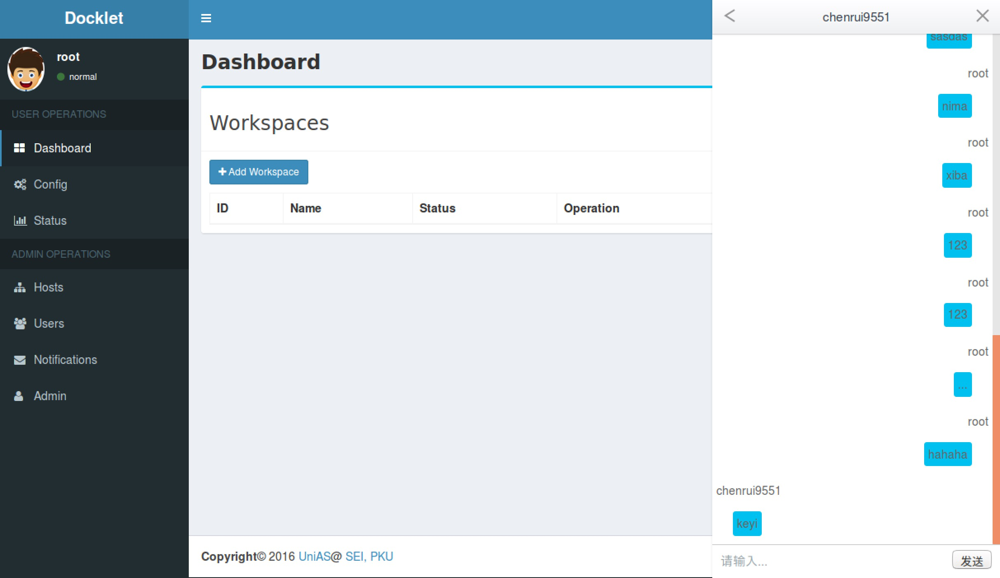

class: center, middle

# Docklet Message Module
Author: [Rui Chen](mailto:chenrui9551@foxmail.com)
 
Source Code: https://github.com/chenrui9551/docklet

---

# Goals

**Message Module** aims to help users commucate with admins.

---

# Design

1. Users' messages could be seen by all admins/roots.
2. All admins could see all messages.

---

# UI
1. Add a new button into the AdminLTE template(base_AdminLTE.html).
2. When the button clicked, the message window appear.
3. **For admins** A message list show all users who have communicated with admins.

---

#Back-end Design
- Create a new table in SQLite to save the message data.
- Provide interfaces for users/admins to query the message data.

---

#Front-end Design
- Use ajax polling to load the message data.(1s)

---

#Demo

![]	(pic1.png)

---

#Demo

---

#Demo

---

#Experiments
- Add a new user.
- User send a message.
- Admin replies messages.

---

#Gains

- Learn and code JavaScript, JQuery, Ajax, Python and Flask things.
- Learn something about LXC and distributed system.

---