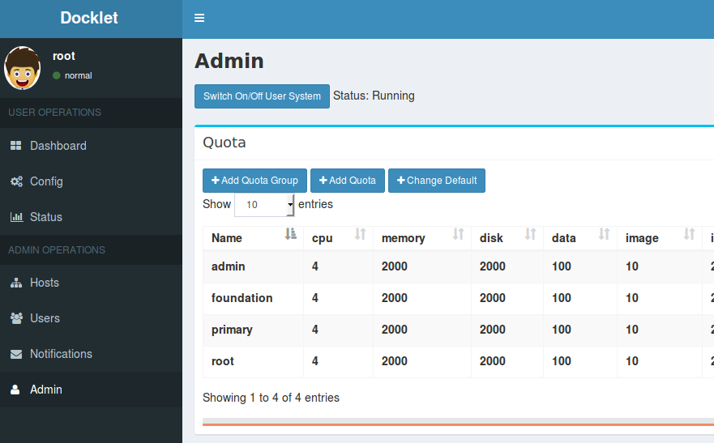
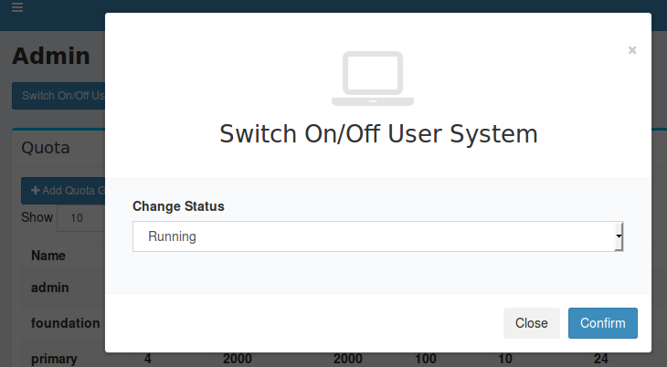
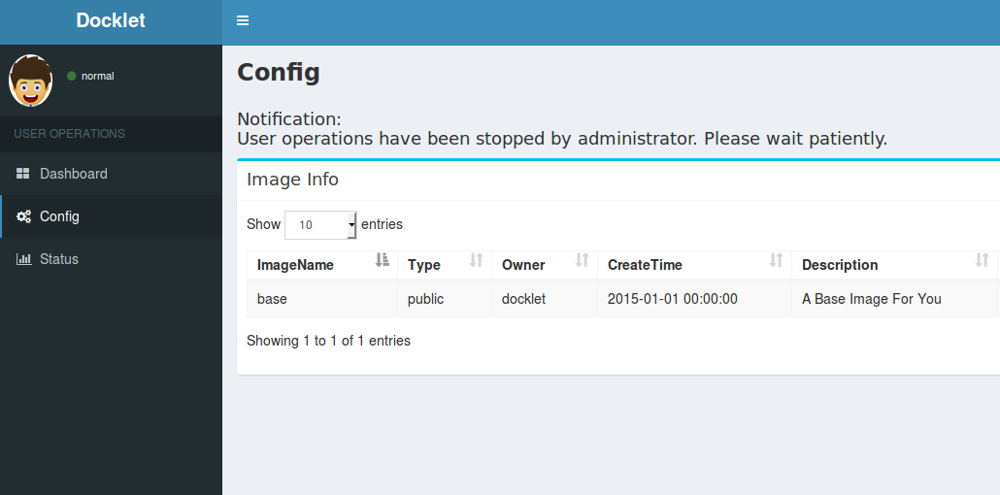

class: center, middle

# Docklet Switch Module 开关模块
Author: [Lu Menghe](mailto:1200012834@pku.edu.cn)

---

#设计目标

在管理员功能中加入开关按钮，用于管理员切换用户系统状态，开启时系统正常工作，关闭时系统停止工作。其原理不是把master和worker停止，而是在前端对用户操作进行限制，禁用用户界面的按钮，并在用户界面进行提示说明。

---

#模块设计
####管理员端:
1. 在管理员的Admin界面中，增加开关按钮“Switch On/Off User System”，用于切换用户系统的状态；
2. 点击开关可弹出显示用户系统状态的对话框，当前状态在选择框中显示，共有Running和Stopped两个状态；
3. 管理员可通过更改选择框中的状态，并点击Confirm进行确认，从而对非管理员用户的集群的操作进行开关；
4. 开关按钮旁实时显示用户系统状态，状态改变后，显示会实时更新。

####用户端:
1. 用户登入后，如果管理员已经将系统状态更改为Stopped，则在Dashboard、Config、Status页面都会出现信息提示；
2. Running状态下对系统不做改变，Stopped状态下，上述三个面板的功能按键都被禁用无法点击，直到管理员重新开启系统为止。

---

#设计原理
- 继续使用Bootstrap开源模板的AdminLTE模块对页面进行设计，加入了按钮并使用模态框（modal）插件进行了弹出框的设计；
- 使用Bootstrap的表单功能完成了POST表单的发送，对后台状态进行更新；
- 用户页面加载时，根据用户系统状态表项决定是否禁用按钮和加载通知。
- 新建用户系统开关状态表项，标识用户系统状态；
- 管理员通过发送表单对用户系统状态进行更改。

---

#图片演示

---

---

---

---

#总结和收获
- 在代码阅读过程中，对Docklet使用的Bootstrap有了实际的了解；
- 对Python语言在网页设计中的应用有了一定了解；
- 由于个人原因导致作业提交过晚，再次向老师和助教表示诚挚的歉意。
