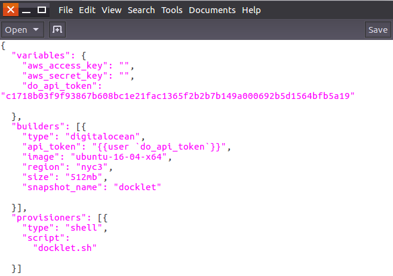
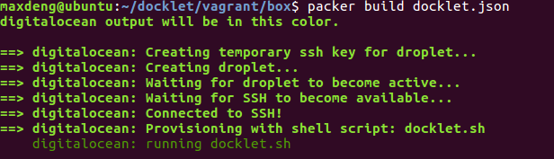
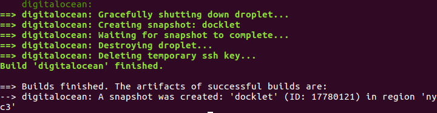
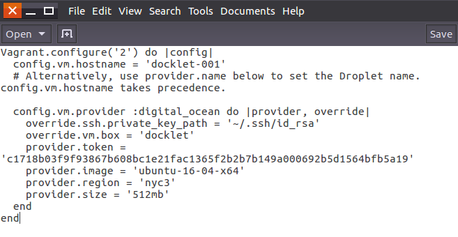

class: center, middle

# VM Application for Docklet
 [Deng Mingshao](mailto:1300012934@pku.edu.cn)
 

---

#目标功能

1. 用户申请高额空间时，自动为其申请配置了docklet环境的虚拟机
2. 尽量简化用户初始化虚拟机需要执行的必需步骤

---

#Vagrant

Vagrant is a powerful open source software for configuring and deploying multiple development environments. It is designed to work on Linux, Mac OS X, or Windows and although it comes with VirtualBox for the virtualization needs, it can be used also with other providers such as VMware or AWS.

---

#Packer
Packer is an open source tool for creating identical machine images for multiple platforms from a single source configuration. Packer is lightweight, runs on every major operating system, and is highly performant, creating machine images for multiple platforms in parallel. 
A machine image is a single static unit that contains a pre-configured operating system and installed software which is used to quickly create new running machines. Machine image formats change for each platform. 

---

#Use Packer to create an image

- Defining user variables
- Use the digitalocean Packer builder to create new images for use with DigitalOcean.
- The shell Packer provisioner provisions machines built by Packer using shell scripts. 

---

#Use Packer to create an image

echo "running docklet.sh"
sleep 30
sudo apt-get update
sudo apt-get install -y redis-server
echo "over 1"
echo "installing cgmanager"
sudo apt-get install -y libcgmanager0
sudo apt-get install -y cgmanager
sudo apt-get install -y git
sudo git clone https://github.com/unias/docklet
wget http://docklet.unias.org/images/basefs-0.11.tar.bz2
...

---

#Packer build

Run Packer to create a machine image.

---

#Packer build

A image "docklet" is successfully built on digitalocean.

---
#Use Vagrant to create a virtual machine

---

#Demo
Use "vagrant up" to create a droplet.

---

#Gains
    
    *对于vagrant和packer两款软件的使用场景和方法有了较为深入的了解
    *了解了云主机从申请到虚拟机建立使用的整体流程，尝试整合建立了一份适用docklet的虚拟机镜像
    *对shell脚本语言有了一定的了解

---