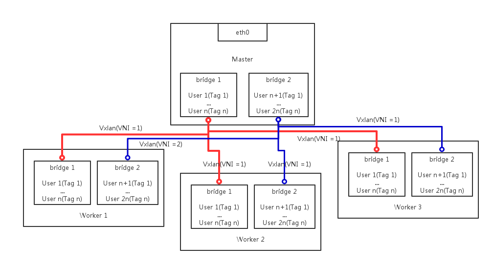

class: center, middle

# Vxlan-Network

Author: [李汪洋](mailto:1300015915@pku.edu.cn)

Source Code: https://github.com/HawkALee/docklet/tree/Vxlan_simple

---

# Goal

1. 修改Docklet使用的网络模型架构，支持使用Vxlan + Vlan，基于三层Vxlan隧道实现二层网络子网的通讯。
2. 提高允许的子网个数，从Vlan支持的4096提高到纯Vxlan模型2^24，以及Vxlan + Vlan混合模型的2^36
---
# Design

1. 对于每个User，分配一个唯一且在生命周期内不变的id，作为netID（在代码中使用vlanid作为变量名称）。
2. 根据netID，每个用户可唯一对应一个子网序对（bridgeID:VlanTag），其中BridgeID = (netID / VnetCount) + 1 而vlanID = (netID % VnetCount) + 1。其中VnetCount是一个需要在启动前设定的参数，含义为每一网桥下允许的最多子网个数（范围为1-4095）
3. 针对每个用户，对虚拟网络环境做如下操作：
    - 创建用户时，检查BridgeID对于的网桥是否存在，不存在则在master上创建对于网桥，并向所有正在运行的work建立Vxlan隧道(VNI = BridgeID)，保持二层的连通性，之后建立一个Port作为网关，并打上Tag值为VlanTag.
    - 新建虚拟机时，虚拟机启动脚本内检查worker上是否存在BridgeID对于的网桥，不存在则创建网桥，然后检查是否已经存在从此worker到master的Vxlan隧道，不存在则建立(VNI = BridgeID)，然后将虚拟机挂载到网桥下一个Port口，并打上Tag，值为用户对应得VlanTag。
4. 总体网络架构如下图:
---

---

# Experiment
1. 经过单机测试，此时不会建立任何Vxlan隧道，只会建立不同网桥，并按照用户netID分配网桥。
2. 经过双机测试，一台作为worker，一台作为master时，测试结果正常。
3. 未经过三机测试，待测试如下：
    - worker均向master打vxlan隧道，那两个worker之间是否能正常通讯

# Feature Work
1. 因为考虑到netID允许范围十分巨大，最大情况远超过IP地址个数范围，所以没有考虑netID回收问题，但是可以加入。
2. 现在不支持在运行中额外加入worker的情况，新加入的worker与老的Bridge之间可能不存在Vxlan隧道（可通过在worker加入时根据master现有网桥情况，添加Vxlan隧道）
3. 没有考虑网桥的回收（如果该网桥上所有用户均被删除，理论上可以回收网桥，但是现在没有实现）
4. 对于以上一点，对于每个用于一个网桥的纯Vxlan模型，可以做到随时回收。
